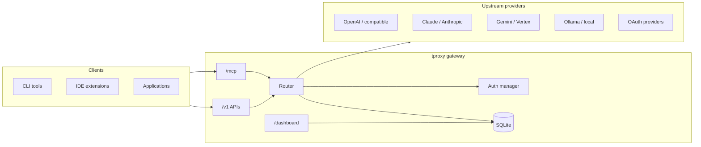

# tproxy

**Self-hosted AI gateway with stable model IDs, multi-provider routing, and an embedded control center.**

tproxy sits between your applications and upstream AI providers. Clients talk to a single OpenAI-, Claude-, or Gemini-compatible endpoint; the gateway handles credential rotation, failover, response rewriting, usage tracking, and OAuth enrollment — without changing client configuration when you add or swap providers.

[](https://github.com/ktvdung2812/TProxy)
[](https://www.npmjs.com/package/@ktvdung1606/tproxy)

---

## Table of contents

- [Overview](#overview)
- [Key features](#key-features)
- [Architecture](#architecture)
- [Supported APIs & providers](#supported-apis--providers)
- [Control center](#control-center)
- [Quick start](#quick-start)
- [Configuration](#configuration)
- [Client integration](#client-integration)
- [Deployment](#deployment)
- [CLI operations](#cli-operations)
- [Security](#security)
- [Development](#development)
- [Documentation](#documentation)
- [License](#license)

---

## Overview

Modern AI workflows often depend on several providers — OpenAI subscriptions, Claude OAuth, local Ollama, Gemini API keys, Codex, Kimi, Cursor, Kiro, and more. Each has its own SDK, auth flow, model naming, and rate limits.

**tproxy unifies them behind one gateway:**

| Problem | tproxy approach |
|--------|------------------|
| Clients hard-code provider model names | **Public model IDs** with aliases; upstream names rewritten in responses (including SSE streams) |
| One account hits rate limits | **Credential rotation** with cooldown, sticky round-robin, and 18+ scheduling strategies |
| Provider outage blocks your app | **Ordered fallback** across routes, combos, and fusion policies |
| Secrets scattered in env files | **Encrypted SQLite storage** with hashed client API keys |
| OAuth is painful on a server | **Built-in OAuth wizards** (browser PKCE, device flow, provider-specific profiles) |
| No visibility into spend | **Usage, quota, pricing estimates**, request logs, and audit events |

tproxy is designed for **local machines, developer workstations, and single-node servers**. Persistence is SQLite-only — no external database cluster required.

---

## Key features

### Routing & models

- **Public model IDs (PPM)** — define stable names (`td-coder-pro`, `gpt-sol`, …) mapped to one or more upstream targets with priority and weight.
- **Aliases** — expose multiple client-facing names for the same model.
- **Combos** — ordered fallback chains across virtual models.
- **Protocol mapping** — transparent Claude/GPT placeholder routing so tools like Claude Code and Codex keep their native tier names while tproxy rewrites upstream model IDs server-side.
- **Auto-combo resolution** — zero-config presets such as `auto`, `auto/coding:fast`, `auto/reasoning:pro`.
- **Fusion routing** — parallel execution across models with arena-style ranking.
- **Session affinity** — sticky routing with configurable TTL.

### Protocol compatibility

- OpenAI **Chat Completions** and **Responses** (including SSE and authenticated WebSocket).
- Anthropic **Messages** and **count_tokens**.
- Google **Gemini** `generateContent` / `streamGenerateContent`.
- Embeddings, image generation/editing, audio (TTS/STT), video jobs, web search, and SSRF-protected web fetch.
- **MCP JSON-RPC** bridge at `POST /mcp`.

### Providers & authentication

- Generic **OpenAI-compatible**, **Anthropic-compatible**, **Gemini**, **Vertex**, and **Ollama** adapters.
- First-party OAuth profiles: **Codex**, **Claude**, **Kimi**, **xAI**, **Antigravity** (Google Cloud Code), **Copilot**, **Cursor**, **Kiro**, and more.
- API-key providers: Tavily search, ElevenLabs audio, image/video aliases, opt-in HTTP plugins.
- **Encrypted proxy pools** (HTTP/S, SOCKS5) bound per provider or credential.
- **9router / CLIProxyAPI import** helpers for migrating existing setups.

### Operations & governance

- **Client API keys** with per-key policies: allowed models, endpoints, RPM, concurrency, input size, media jobs, and daily budget.
- **Teams** with scoped limits and cost aggregation.
- **Token Saver** compression pipeline (RTK, Caveman, CCR, Headroom, LLMLingua-2).
- **Circuit breaker** per provider (OPEN / DEGRADED / CLOSED).
- **Tunnel exposure** — Cloudflare quick tunnel and Tailscale integration from the dashboard.
- **Retention policies** for usage events, request logs, audit trails, and OAuth sessions.
- **Config export/import** (secret-free YAML/JSON) plus encrypted OAuth bundle backup/restore.

### Dashboard

Embedded React **control center** served from the same process — no separate frontend deployment. Manage providers, models, keys, logs, and settings from the browser.

---

## Architecture



**Design principles** (from the [specifications](../specs/)):

- Provider adapters own protocol and authentication details; the router stays provider-agnostic.
- Public model IDs are virtual and always support aliases plus response-name rewriting.
- SQLite is the sole persistence backend for local and single-node deployments.

---

## Supported APIs & providers

### Gateway endpoints

| Endpoint | Description |
|----------|-------------|
| `GET /healthz` | Liveness / readiness |
| `GET /v1/models` | Public model catalog |
| `POST /v1/chat/completions` | OpenAI Chat Completions |
| `POST /v1/responses` | OpenAI Responses (+ SSE, WebSocket) |
| `POST /v1/messages` | Anthropic Messages |
| `POST /v1/messages/count_tokens` | Token counting |
| `POST /v1/embeddings` | Embeddings |
| `POST /v1/images/*` | Image generation & editing |
| `POST /v1/audio/*` | Speech & transcription |
| `POST /v1/videos/*` | Video generation jobs |
| `POST /v1/search` | Web search (Tavily adapter) |
| `POST /v1/web/fetch` | SSRF-protected URL fetch |
| `POST /mcp` | MCP JSON-RPC bridge |
| `/dashboard/` | Embedded management UI |
| `/api/admin/*` | Authenticated management API |

### Provider types

tproxy supports a broad catalog including:

`openai-compatible` · `anthropic-compatible` · `gemini` · `vertex` · `ollama` · `codex` · `claude` · `kimi` · `xai` · `antigravity` · `copilot` · `cursor` · `kiro` · `qwen` · `tavily` · `elevenlabs` · `image` · `video` · `plugin-http` · and additional OAuth presets (Qoder, Cline, GitLab, Kimchi, …).

See the provider catalog in the dashboard or `web/src/components/providers/catalog.ts` for the full list and connection methods.

---

## Control center

After starting tproxy, open the dashboard:

```text
http://127.0.0.1:28120/dashboard/
```

Default login password: `123123` (change it under **Settings**).

| Section | Pages |
|---------|-------|
| **Dashboard** | Overview — gateway status, API keys, quick links |
| **Routing** | PPM (public models), Combos, Protocol mapping (Claude/Codex codegen) |
| **Infrastructure** | Providers, Health overview, Proxy pools |
| **Monitoring** | Usage, Token Saver, Quota Tracker |
| **Developer** | API endpoint reference, Chat playground, CLI Tools setup guides |
| **System** | Logs & audit, Settings (rotation, retention, backup) |

---

## Quick start

### Prerequisites

- **Go 1.26+** (to build from source)
- **Node.js 18+** (for dashboard development or npm wrapper)

### 1. Clone and configure

```bash
git clone https://github.com/ktvdung2812/TProxy.git
cd TProxy
cp config.example.yaml config.yaml
cp .env.example .env.run
```

Generate a master encryption key and add it to `.env.run`:

```bash
go run ./cmd/tproxy --print-master-key
# Set TPROXY_MASTER_KEY in .env.run to the printed value
```

### 2. Development (hot reload)

```bash
npm install
npm run dev
```

| Service | URL |
|---------|-----|
| Dashboard (Vite HMR) | http://127.0.0.1:28121/dashboard/ |
| API gateway | http://127.0.0.1:28120/v1 |
| Embedded dashboard (prod build) | http://127.0.0.1:28120/dashboard/ |
| Health | http://127.0.0.1:28120/healthz |

### 3. Production build

```bash
npm run build
source .env.run
./bin/tproxy --config config.yaml
```

### 4. Smoke test

```bash
curl http://127.0.0.1:28120/healthz

curl http://127.0.0.1:28120/v1/models \
  -H "Authorization: Bearer $TPROXY_API_KEY"
```

### npm install (wrapper)

```bash
npm install -g @ktvdung1606/tproxy
tproxy --config config.yaml
```

The npm package ships a CLI wrapper and default config. Place a built `tproxy` binary next to the package, or run from a local clone with `go run ./cmd/tproxy`. See [`npm/README.md`](npm/README.md).

---

## Configuration

Configuration is YAML-first. On first start, tproxy seeds SQLite from `config.yaml` and can reload changes at runtime.

```yaml
server:
  host: 127.0.0.1
  port: 28120
  allow-local-without-key: false
  allow-remote-management: false

database:
  driver: sqlite
  dsn: tproxy.db

security:
  master-key-env: TPROXY_MASTER_KEY
  management-secret-env: TPROXY_MANAGEMENT_SECRET

routing:
  strategy: round-robin
  session-affinity: true
  session-affinity-ttl: 1h

client-api-keys:
  - id: local
    name: Local development
    key-env: TPROXY_API_KEY

providers: []   # add via dashboard or YAML
models: []      # public model definitions
```

**Important environment variables:**

| Variable | Purpose |
|----------|---------|
| `TPROXY_MASTER_KEY` | Encrypts provider secrets in SQLite (required before storing credentials) |
| `TPROXY_API_KEY` | Client API key for `/v1/*` requests |
| `TPROXY_MANAGEMENT_SECRET` | Dashboard and `/api/admin/*` authentication |

For a minimal first boot, copy `internal/config/default.yaml` or run without `config.yaml` — the database starts empty and you configure everything from the dashboard.

Full example with sample providers: [`config.example.yaml`](config.example.yaml).

---

## Client integration

Point any OpenAI-, Anthropic-, or Gemini-compatible client at tproxy:

```text
Base URL:  http://127.0.0.1:28120/v1
API key:   <your TPROXY_API_KEY>
Model:     <your public model ID or alias>
```

**Claude Code / Codex** — use the **Mapping** page in the dashboard to generate `settings.json` or `config.toml` snippets that keep native placeholder names (`sonnet`, `gpt-sol`, …) while tproxy maps them to real upstream models.

**CLI Tools** — the dashboard includes setup guides for popular coding CLIs (environment exports, config file patches, and copy-paste scripts).

**Remote access** — expose the gateway via Cloudflare quick tunnel or Tailscale from **APIs → Tunnel**, or put a reverse proxy with TLS in front of port `28120`.

---

## Deployment

A ready-made server bundle lives in [`deploy/`](deploy/README.md):

- Linux `amd64` / `arm64` binaries
- `docker-compose.yml` for container deployment
- `systemd` unit file
- Backup and recovery procedures (`deploy/RECOVERY.md`)

```bash
cd deploy
cp .env.example .env
# Set TPROXY_MASTER_KEY, TPROXY_API_KEY, TPROXY_MANAGEMENT_SECRET
docker compose up -d --build
```

For remote management or OAuth callbacks on a public host, set `server.allow-remote-management: true` and configure provider `oauth.redirect-url` to your public domain. Always terminate TLS at a reverse proxy.

---

## CLI operations

```bash
# Generate encryption key
tproxy --print-master-key

# Consistent SQLite backup
tproxy --config config.yaml --backup-database backups/tproxy.db

# Restore from backup
tproxy --config config.yaml --restore-database backups/tproxy.db

# Integrity check
tproxy --config config.yaml --integrity-check

# Export / import encrypted OAuth credentials
tproxy --config config.yaml --export-auth oauth-bundle.enc
tproxy --config config.yaml --import-auth oauth-bundle.enc

# Remote CLI connect (tunnel to a running instance)
tproxy connect <remote-url>
```

---

## Security

- Provider credentials and proxy pool URLs are **encrypted at rest** with `TPROXY_MASTER_KEY`.
- Client API keys are **hashed**; only a one-time plaintext is shown on creation.
- Management API and dashboard require `TPROXY_MANAGEMENT_SECRET` (default dashboard password is stored hashed in SQLite).
- OAuth tokens use encrypted envelopes with refresh deduplication and redacted admin responses.
- Request logging supports correlation IDs with sensitive field redaction.
- `allow-local-without-key` and `allow-remote-management` are **opt-in** — keep them disabled unless you understand the exposure.

---

## Development

```bash
# Full dev stack (Go backend + Vite dashboard)
npm run dev

# Build frontend + binary only
npm run build

# Backend only
source .env.run && go run ./cmd/tproxy --config config.yaml

# Run Go tests
go test ./...
```

**Project layout:**

```text
tproxy/
├── cmd/tproxy/          # Main binary and `connect` subcommand
├── internal/
│   ├── api/             # HTTP handlers, dashboard embedding
│   ├── auth/            # OAuth, token refresh, provider auth
│   ├── router/          # Model routing, fallback, fusion, auto-combo
│   ├── providers/       # Upstream adapters
│   ├── store/           # SQLite persistence
│   ├── tunnel/          # Cloudflare / Tailscale exposure
│   └── ...
├── web/                 # React dashboard (Vite + TypeScript)
├── deploy/              # Production deployment bundle
├── npm/                 # npm CLI wrapper package
├── config.example.yaml
└── docs/IMPLEMENTATION.md
```

---

## Documentation

| Resource | Description |
|----------|-------------|
| [`docs/IMPLEMENTATION.md`](docs/IMPLEMENTATION.md) | Current implementation matrix |
| [`../specs/`](../specs/) | Product specifications and acceptance criteria |
| [`deploy/README.md`](deploy/README.md) | Server deployment guide |
| [`npm/README.md`](npm/README.md) | npm package usage |

Implementation status is tracked against the [delivery plan](../specs/07-delivery-plan.md). When behavior and specs diverge, the spec is the source of truth until an explicit change is reviewed.

---

## License

MIT — see the repository for details.

---

<p align="center">
  <a href="https://github.com/ktvdung2812/TProxy">GitHub</a> ·
  <a href="https://www.npmjs.com/package/@ktvdung1606/tproxy">npm</a> ·
  <a href="docs/IMPLEMENTATION.md">Implementation status</a>
</p>
